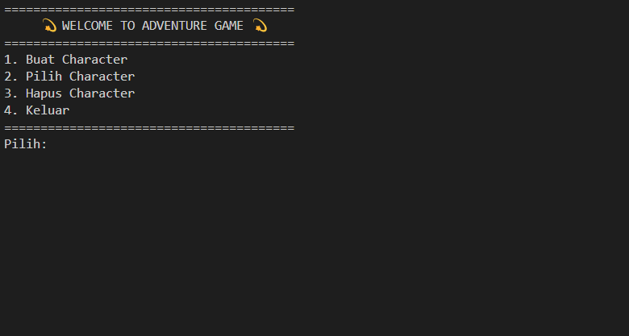
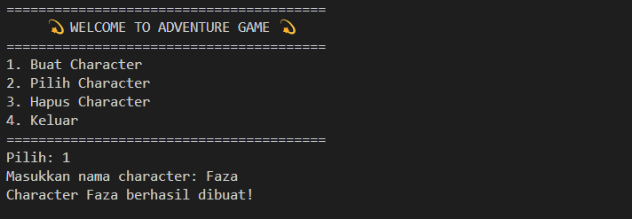
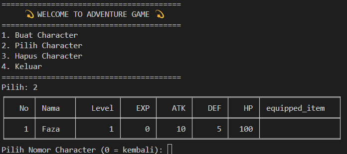
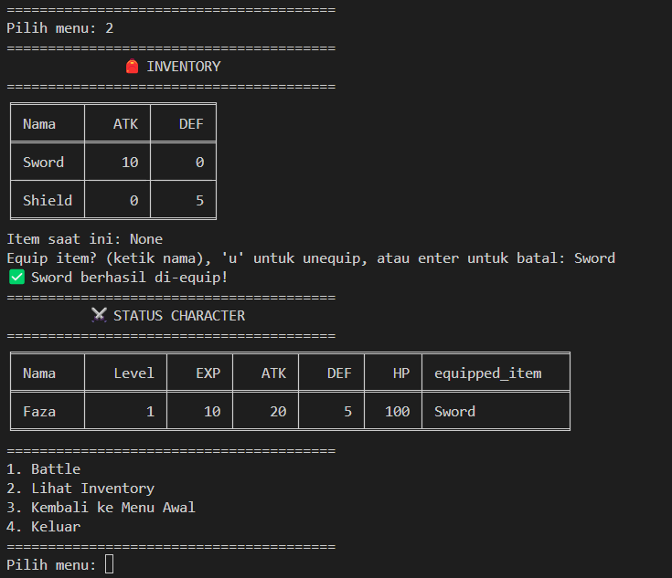
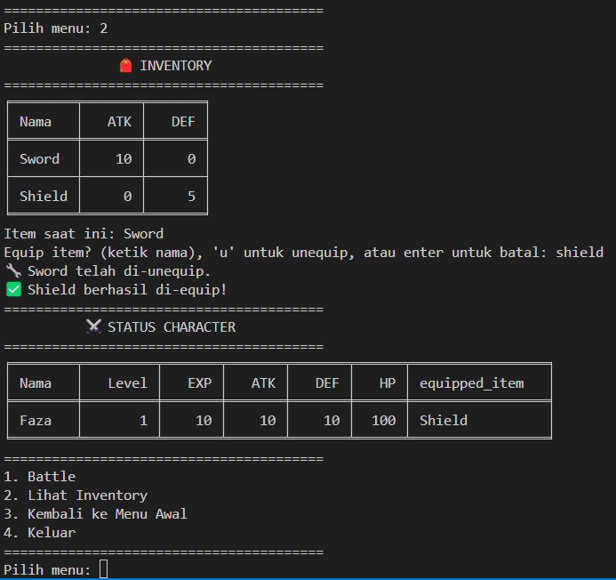
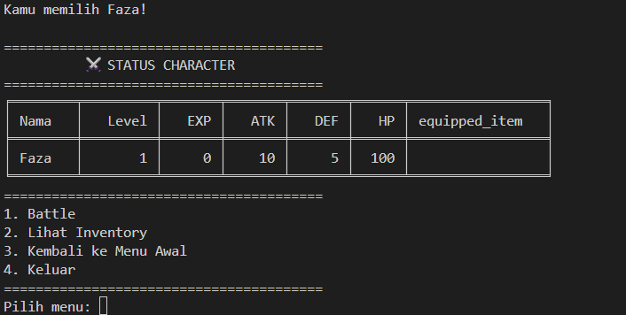
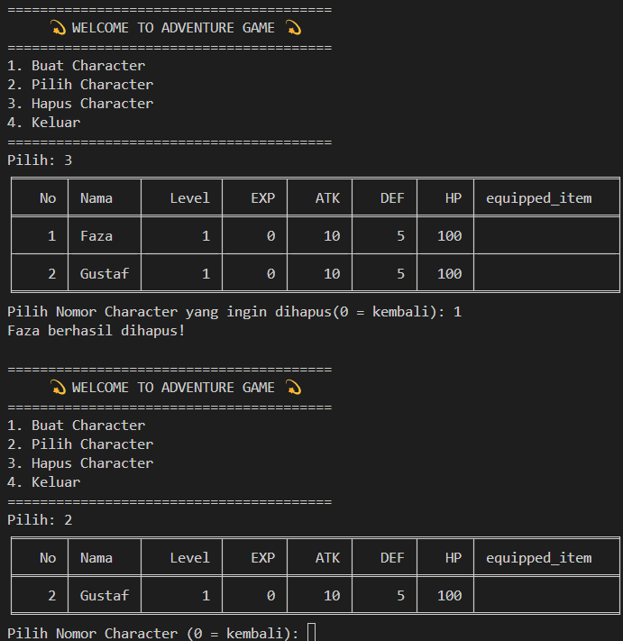

# 💫 Capstone-1-Purwadhika: Adventure Game

Capstone Project ini merupakan bagian dari Module 1 Job Connector Bootcamp Data Science & Machine Learning Purwadhika. Program yang dibuat adalah Adventure Game berbasis text di Python, dengan fitur CRUD (Create, Read, Update, Delete) dan battle system sederhana untuk melatih konsep dasar programming, data structure, dan logic flow.

---

## 📝 **Fitur Utama**

✅ **Create** – Membuat character baru  
✅ **Read** – Melihat status character dan inventory  
✅ **Update** – Mengupdate level, stat, dan equip item  
✅ **Delete** – Menghapus character dari list  
✅ Equip & Unequip item untuk menambah/mengurangi stat (ATK / DEF)  
✅ Battle melawan musuh secara random dengan perhitungan damage dan EXP

---

## 🎯 **Konteks**

Project ini dibuat untuk memenuhi Capstone Module 1 Purwadhika, dengan tujuan melatih penggunaan:
- **Function (regular function)**
- **Collection data types (list, dict)**
- **Conditional dan Looping**

---

## 👤 **Pengguna**

- **Pengembang pemula Python** yang ingin memahami penerapan CRUD menggunakan function dan collection (list & dictionary).
- **Siapa pun** yang tertarik membuat mini RPG di terminal.
---

## 📸 **Screenshot**

### Main Menu

### Buat Character

### Pilih Character

### Battle

### Inventory & Equip

###  Unequip

### Status Character

### Hapus Character

